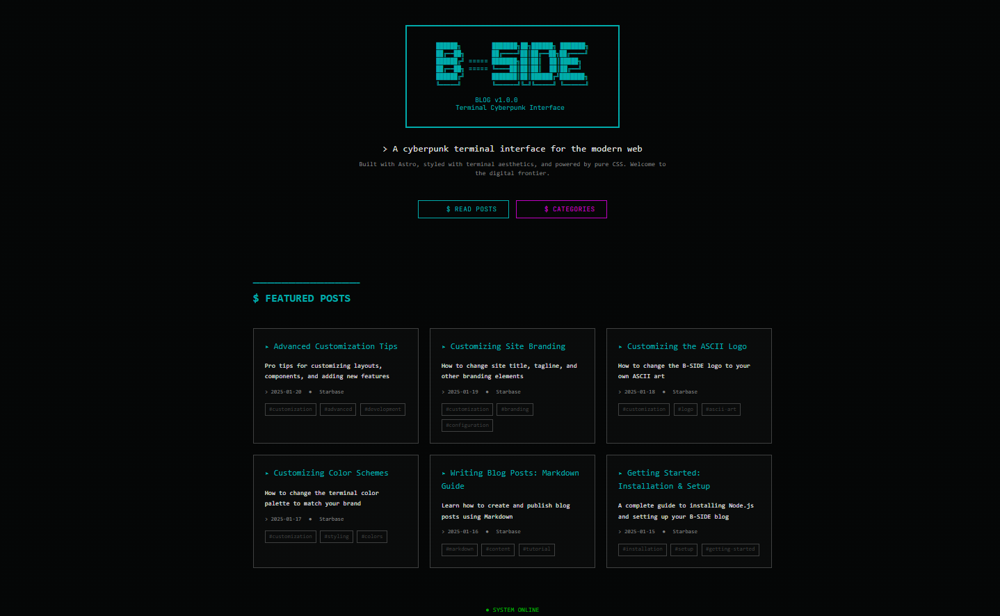
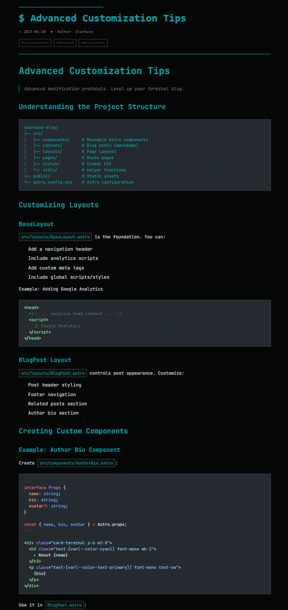

# B-SIDE Blog - Terminal Cyberpunk Theme

> A terminal-themed blog built with Astro, styled with cyberpunk aesthetics, and powered by pure CSS.

A minimal, performant blog template featuring a retro terminal interface with neon accents, ASCII art, and zero JavaScript by default.


## 📸 Screenshots

### Homepage

*Terminal-themed homepage with featured posts and cyberpunk aesthetics*

### Blog Post

*Example blog post page with terminal styling and code examples*

## 🚀 Quick Start

### Prerequisites

- **Node.js** 18.14.1 or higher ([Download](https://nodejs.org/))
- **npm** (comes with Node.js)

### Installation

1. **Clone the repository**
   ```bash
   git clone https://github.com/ljgrohn/starbase-blog.git
   cd starbase-blog
   ```

2. **Install dependencies**
   ```bash
   npm install
   ```

3. **Start the development server**
   ```bash
   npm run dev
   ```

4. **Open your browser**
   Navigate to `http://localhost:4321/`

That's it! Your terminal blog is running locally.

## 📝 Writing Blog Posts

### Create a New Post

1. Create a new `.md` file in `src/content/blog/`
2. Add frontmatter at the top:

```markdown
---
title: "Your Post Title"
description: "A brief description"
pubDate: 2025-01-20
author: "Your Name"
featured: false
tags: ["tag1", "tag2"]
---

# Your Post Title

Your content here in Markdown...
```

3. Save the file - it will automatically appear in your blog!

### Frontmatter Fields

- `title` (required) - Post title
- `description` (required) - SEO description
- `pubDate` (required) - Date in `YYYY-MM-DD` format
- `author` (optional) - Defaults to "Starbase"
- `featured` (optional) - Set to `true` to feature on homepage
- `tags` (optional) - Array of tags for categorization

### Markdown Tips

Use terminal-style elements for authenticity:

```markdown
▸ Bullet points
━━━━━━━━━━━━━━━━━━━━━━━━━━━━━━ (dividers)
● Status indicators
$ Terminal prompts
```

See the [Writing Blog Posts guide](/blog/writing-blog-posts) for more details.

## 🎨 Customization Guide

### Change Colors

Edit `src/styles/global.css` and modify the color variables in the `@theme` block:

```css
@theme {
  --color-cyan: #00abab;        /* Primary accent */
  --color-magenta: #c300c3;     /* Secondary accent */
  --color-bg-primary: #050505;   /* Background */
  /* ... more colors */
}
```

📖 **Full guide**: [Customizing Color Schemes](/blog/customizing-colors)

### Change the Logo

Edit `src/utils/ascii-art.ts` and replace the `LOGO_TEMPLATES.BSIDE` value:

```typescript
export const LOGO_TEMPLATES = {
  BSIDE: `
  Your ASCII art here
  `,
};
```

📖 **Full guide**: [Customizing the ASCII Logo](/blog/customizing-logo)

### Change Site Branding

Update these files to rebrand:

- **Page titles**: Edit layout files (`src/layouts/*.astro`)
- **Homepage tagline**: `src/pages/index.astro` (line ~17)
- **Footer**: `src/pages/index.astro` (line ~54)
- **Default author**: `src/content/config.ts` (line ~9)

📖 **Full guide**: [Customizing Site Branding](/blog/customizing-branding)

## 📁 Project Structure

```
starbase-blog/
├── public/              # Static assets (images, favicon)
├── src/
│   ├── components/     # Reusable components
│   │   └── FeaturedPosts.astro
│   ├── content/        # Blog posts (markdown)
│   │   └── blog/
│   ├── layouts/        # Page layouts
│   │   ├── BaseLayout.astro
│   │   └── BlogPost.astro
│   ├── pages/          # Route pages
│   │   ├── blog/
│   │   ├── categories/
│   │   └── index.astro
│   ├── styles/         # Global CSS
│   │   └── global.css
│   └── utils/          # Helper functions
│       └── ascii-art.ts
├── astro.config.mjs    # Astro configuration
└── package.json
```

## 🧞 Available Commands

| Command                | Action                                    |
| :--------------------- | :---------------------------------------- |
| `npm install`          | Install dependencies                      |
| `npm run dev`          | Start dev server at `localhost:4321`     |
| `npm run build`        | Build for production to `./dist/`        |
| `npm run preview`      | Preview production build locally          |
| `npm run astro check`  | Run TypeScript type checking              |

## 🎯 Features

- ✅ **Zero JavaScript** by default (pure HTML/CSS)
- ✅ **Terminal aesthetics** with cyberpunk theme
- ✅ **Markdown-based** blog posts
- ✅ **Tag/category system** for organization
- ✅ **Featured posts** on homepage
- ✅ **Fully responsive** design
- ✅ **Type-safe** content with TypeScript
- ✅ **Fast builds** with Astro's static generation

## 📚 Documentation

Comprehensive guides are available as blog posts:

1. **[Getting Started: Installation & Setup](/blog/getting-started-installation)**
   - Installing Node.js
   - Setting up the project
   - Running the dev server

2. **[Writing Blog Posts: Markdown Guide](/blog/writing-blog-posts)**
   - Creating posts
   - Markdown syntax
   - Frontmatter options

3. **[Customizing Color Schemes](/blog/customizing-colors)**
   - Changing the color palette
   - Color scheme ideas
   - Accessibility tips

4. **[Customizing the ASCII Logo](/blog/customizing-logo)**
   - Creating ASCII art
   - Replacing the logo
   - Using logo utilities

5. **[Customizing Site Branding](/blog/customizing-branding)**
   - Changing titles and taglines
   - Updating footer
   - Rebranding checklist

6. **[Advanced Customization Tips](/blog/advanced-customization)**
   - Creating components
   - Adding pages
   - Performance optimization

## 🚀 Deployment

This blog builds to static HTML/CSS/JS. Deploy to any static hosting service:

### Netlify

1. Connect your GitHub repository
2. Build command: `npm run build`
3. Publish directory: `dist`
4. Deploy!

### Vercel

1. Import your GitHub repository
2. Framework preset: Astro
3. Deploy!

### GitHub Pages

Use GitHub Actions to build and deploy automatically. See [Astro's deployment guide](https://docs.astro.build/en/guides/deploy/github/).

## 🛠️ Tech Stack

- **[Astro](https://astro.build)** - Static site generator
- **[Tailwind CSS](https://tailwindcss.com)** - Utility-first CSS framework
- **[TypeScript](https://www.typescriptlang.org/)** - Type safety
- **[Content Collections](https://docs.astro.build/en/guides/content-collections/)** - Type-safe content

## 📄 License

This project is open source and available under the [MIT License](LICENSE).

## 🤝 Contributing

Contributions, issues, and feature requests are welcome! Feel free to check the [issues page](https://github.com/ljgrohn/starbase-blog/issues).

## 🙏 Acknowledgments

- Built with [Astro](https://astro.build)
- Terminal aesthetics inspired by retro computing
- Font: [JetBrains Mono](https://www.jetbrains.com/lp/mono/)

---

**Ready to customize?** Start with the [installation guide](/blog/getting-started-installation) or jump to [writing your first post](/blog/writing-blog-posts).

> ● SYSTEM ONLINE | Ready for input...
